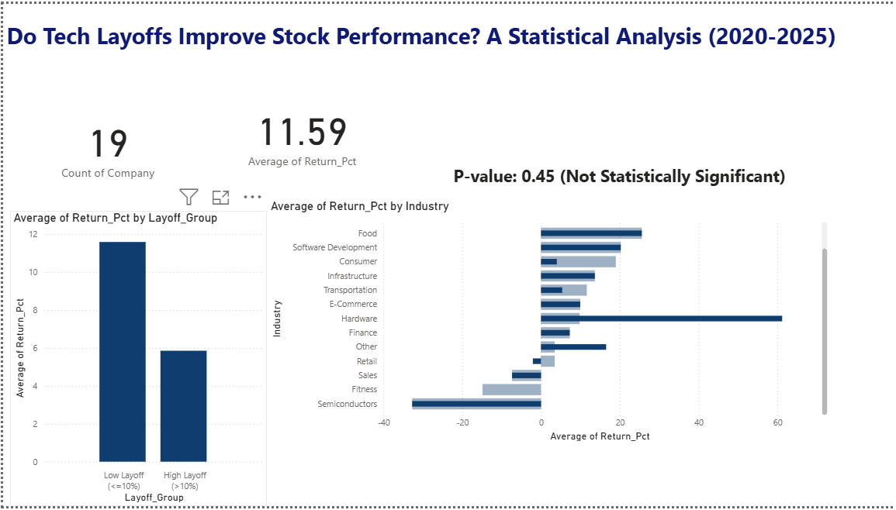

# Do Tech Layoffs Improve Stock Performance? A Statistical A/B Testing Analysis (2020–2025)

## 📌 Business Problem

Tech companies frequently justify layoffs as a strategy to cut costs, improve operational efficiency, and boost investor confidence. But does the data actually support this claim?

This project applies **A/B testing methodology** and **hypothesis testing** to statistically evaluate whether the size of a company's layoff (as a % of workforce) has a measurable impact on its stock price performance in the 90 days following the announcement.

---

## 🧪 A/B Testing Framework

This analysis is structured as a classic A/B test, applied to a real-world business/finance question rather than a typical UX experiment:

| A/B Testing Element | This Project |
|---|---|
| **Group A (Control)** | Low Layoff Group — ≤10% of workforce laid off |
| **Group B (Treatment)** | High Layoff Group — >10% of workforce laid off |
| **Metric Measured** | Stock return % (90 days post-layoff announcement) |
| **Null Hypothesis (H0)** | Layoff percentage has no significant effect on stock return |
| **Alternate Hypothesis (H1)** | High layoff % companies show a significantly different stock return than low layoff % companies |
| **Statistical Test** | Independent two-sample t-test (`scipy.stats.ttest_ind`) |
| **Significance Level** | α = 0.05 |

---

## 🗂️ Data Sources

1. **Layoffs Dataset** — [Tech Layoffs 2020–2025 (Kaggle)](https://www.kaggle.com/datasets/ulrikeherold/tech-layoffs-2020-2024), containing company name, layoff date, % of workforce affected, industry, and funding stage.
2. **Stock Price Data** — Fetched via the `yfinance` API for all publicly traded companies present in the layoffs dataset.

Only publicly traded companies were included in the analysis, since private companies (e.g., startups without stock tickers) cannot be evaluated for stock performance. This reduced the dataset to **19 unique public companies** across **55 layoff events**.

---

## 🛠️ Methodology

1. **Data Cleaning** — Filtered the layoffs dataset to only publicly traded companies and mapped each to its stock ticker (e.g., Amazon → AMZN, Meta → META).
2. **Stock Return Calculation** — For each layoff event, fetched stock closing price ~30 days before and ~90 days after the layoff date, then calculated the percentage return.
3. **Group Assignment** — Split all layoff events into two groups based on the % of workforce laid off (High Layoff >10% vs. Low Layoff ≤10%).
4. **Hypothesis Testing** — Ran an independent t-test comparing average stock returns between the two groups.
5. **Visualization** — Built comparison charts (box plot, industry-wise breakdown) to visually support the statistical findings.

---

## 📊 Key Results

| Group | Mean Return | Median Return | Std Dev | n |
|---|---|---|---|---|
| **High Layoff (>10%)** | 5.86% | 7.11% | 28.97 | 21 |
| **Low Layoff (≤10%)** | 11.59% | 13.26% | 24.34 | 34 |

- **T-statistic:** -0.7575
- **P-value:** 0.4535

Since p > 0.05, we **fail to reject the null hypothesis**. There is **no statistically significant difference** in stock returns between companies that conducted large layoffs versus smaller ones.

---

## 💡 Business Insight

Counter-intuitively, the data shows companies with *smaller* layoffs had a slightly *higher* average stock return than those with larger layoffs — but this difference is not statistically significant and could be due to random variation.

**Conclusion:** Layoff size alone is not a reliable predictor of stock performance. Investors and stakeholders should not assume that aggressive layoffs automatically translate to stronger stock returns — other fundamentals (revenue growth, product performance, and macroeconomic conditions) likely play a much larger role.

---

## 📈 Dashboard

An executive dashboard was built in Power BI to summarize the findings visually, including:
- KPI cards (company count, average return %, p-value)
- Layoff group comparison chart
- Industry-wise average return breakdown



---

## 🔧 Tools Used

- **Python** (pandas, scipy, yfinance, matplotlib, seaborn) — Google Colab
- **Power BI Desktop** — Dashboard & visualization
- **Kaggle** — Data source

---

## 📁 Repository Structure

```
├── README.md
├── notebook/
│   └── Layoff_Impact_on_Stock_Performance_AB_Test.ipynb
├── data/
│   └── layoffs_stock_analysis_final.csv
└── dashboard/
    ├── Layoff_Impact_Dashboard.pdf
    └── dashboard_screenshot.png
```

---

## 🚀 Future Improvements

- Expand the sample size by including more historical layoff events pre-2020
- Control for broader market movement (e.g., compare against S&P 500 returns over the same period) to isolate company-specific effects
- Segment analysis by company size or funding stage in addition to industry
